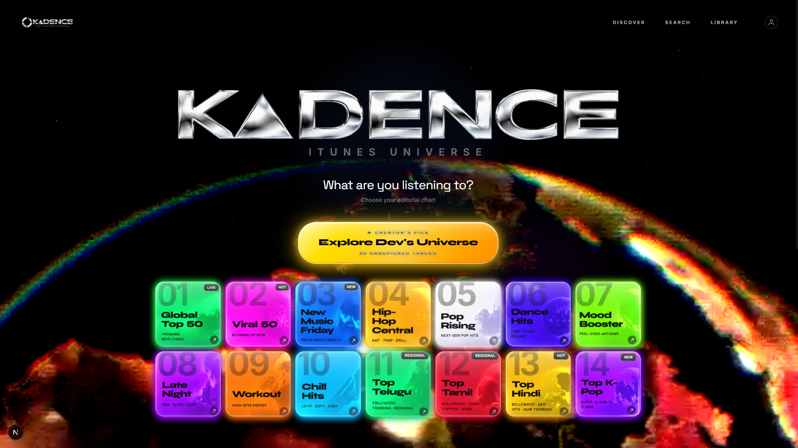
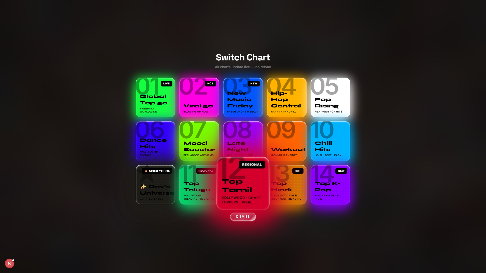
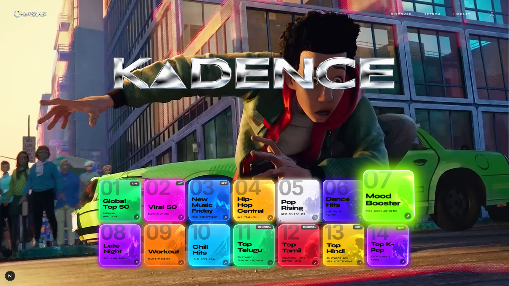
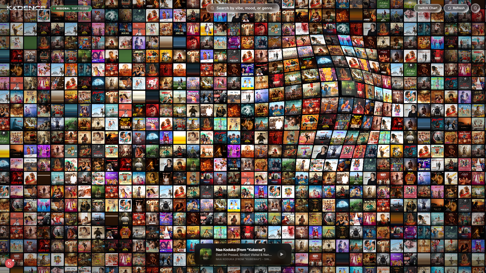
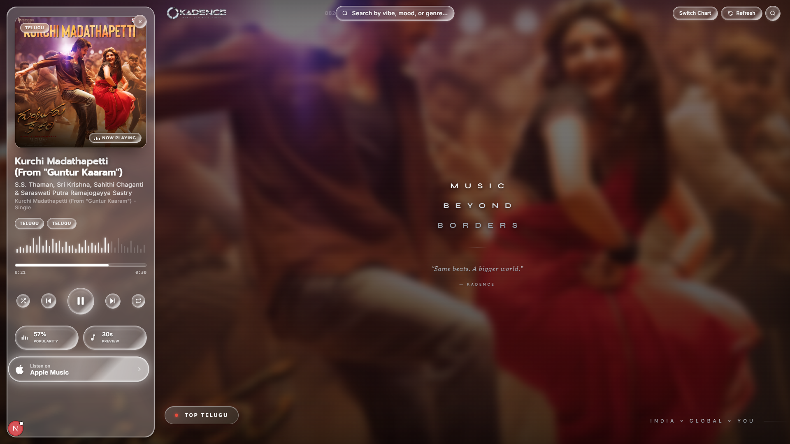
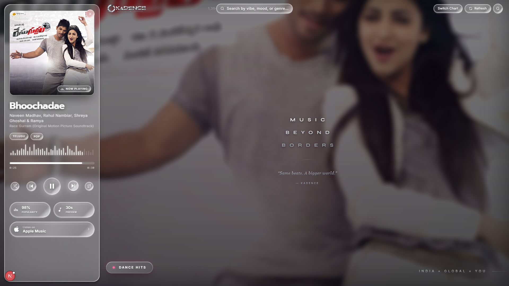
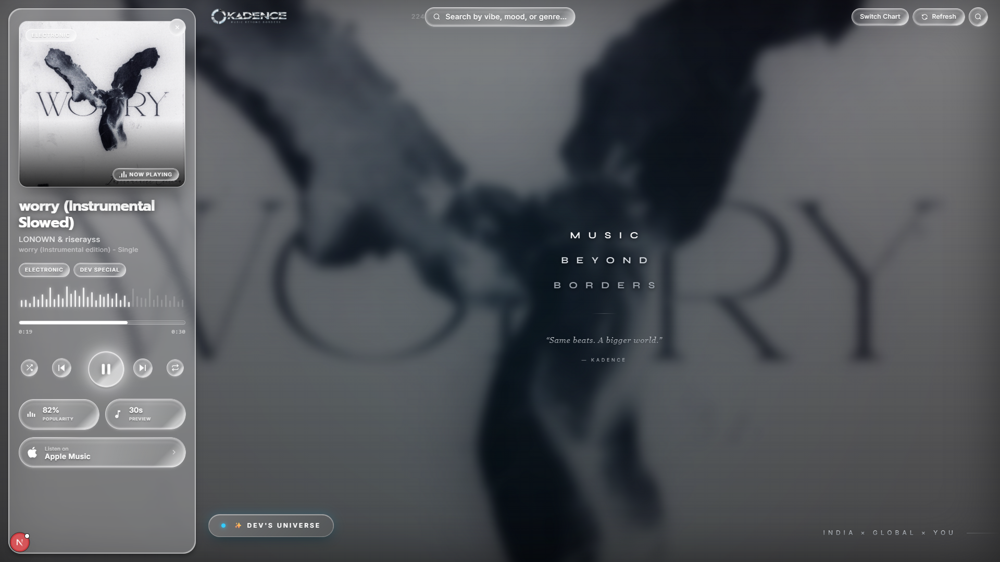

<div align="center">


### Music Beyond Borders

**An interactive music discovery platform that turns listening data into immersive visual experiences.**


</div>

---

## 🚀 Overview

**Kadence** reimagines music discovery for listeners who want more than a static list of tracks. Instead of scrolling a feed, users explore songs, artists, and genres through editorial charts, cinematic hero moments, and an interactive relationship graph — all wrapped in a fast, glassmorphic interface with real-time audio previews.

Kadence combines:

- 🎧 Curated music discovery across genres and regions
- 📊 Interactive, animated charts and rankings
- 🌐 Artist and song relationship visualization
- ⚡ Real-time hover interactions and instant previews
- 🎨 A modern, immersive, motion-driven UI

---

## 📸 Screenshots

### Home — Editorial Chart Selection
The landing experience lets users choose a chart to explore, with a rotating cinematic backdrop and a spotlighted **Creator's Pick**.

<p align="center">
  
</p>

### Switch Chart
A live, no-reload chart switcher lets users jump between Global Top 50, Viral 50, regional charts (Telugu, Tamil, Hindi, K-Pop), mood-based charts, and the curator's own universe.

<p align="center">
  
</p>

### Cinematic Hero States
The homepage background dynamically shifts per session, keeping the chart-selection experience fresh every visit.

<p align="center">
  
</p>

### Chart Grid — Music Universe
Selecting a chart drops the user into a dense, hover-reactive album wall, complete with live search by vibe, mood, or genre.

<p align="center">
  
</p>

### Now Playing — Song Detail Panel
Every track opens into a rich now-playing panel with waveform scrubbing, popularity score, preview length, genre tags, and a direct link to Apple Music.

<p align="center">
  
  
</p>

<p align="center">
  
</p>

---

## ✨ Key Features

### 🎵 Song Discovery
- Browse trending and popular tracks across global and regional charts
- Explore detailed song metadata and artist credits
- Direct links out to streaming platforms (Apple Music)

### 📊 Interactive Music Charts
- Dynamic, animated ranking grids (Global Top 50, Viral 50, Hip-Hop Central, Pop Rising, and more)
- Live chart switching with no page reload
- Regional and mood-based chart categories (Telugu, Tamil, Hindi, K-Pop, Workout, Chill, Late Night)

### 🎧 Audio Previews
- Instant 30-second preview playback with waveform scrubbing
- Popularity score and preview-length indicators per track
- Lightweight, seamless playback experience

### 🌐 Music Relationship Graph
- Visualize connections between songs, artists, genres, and related tracks
- Interactive, node-based exploration of the music universe

### 🎨 Premium UI Experience
- Glassmorphism-inspired design language
- Smooth Framer Motion animations and micro-interactions
- Cinematic, rotating hero backdrops
- Fully responsive layout

### 🔍 Search & Exploration
- Fast search by vibe, mood, or genre
- Intelligent content discovery across artists and songs

---

## 🛠️ Tech Stack

| Category | Technologies |
|---|---|
| **Frontend** | React, Next.js, TypeScript, Tailwind CSS |
| **Animation & Visualization** | Framer Motion, Three.js, React Three Fiber |
| **State Management** | Zustand |
| **Tooling** | Node.js, npm, Git |

---

## 🏗️ Project Structure

```bash
kadence/
├── app/
├── components/
├── hooks/
├── lib/
├── public/
├── scripts/
├── store/
├── screenshots/
├── package.json
└── README.md
```

---

## ⚙️ Installation

**Clone the repository**
```bash
git clone https://github.com/septilex/KADENCE.git
```

**Navigate into the project**
```bash
cd KADENCE
```

**Install dependencies**
```bash
npm install
```

**Start the development server**
```bash
npm run dev
```

Then open [http://localhost:3000](http://localhost:3000) in your browser.

---

## 🎯 Vision

Kadence aims to redefine music exploration by making music data interactive, visual, and enjoyable. Rather than simply listening to music, users can:

- Discover hidden connections between artists and tracks
- Explore entire artist ecosystems
- Interact with real-time music trends
- Experience data through engaging visual storytelling

---

## 🔮 Future Roadmap

- 🤖 AI-powered music recommendations
- 🎵 Personalized listening insights
- 🌍 Global music trend analysis
- 👥 Social music sharing
- 📈 Advanced analytics dashboard
- 🎙️ Playlist generation with AI
- 📱 Mobile application support

---

## 👨‍💻 Author

Developed with passion for music, data visualization, and immersive web experiences.

<div align="center">

**Kadence — Explore Music Differently.** 🎵✨

</div>